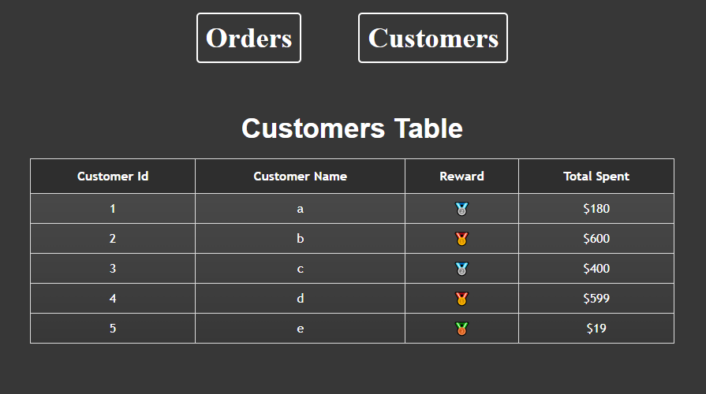
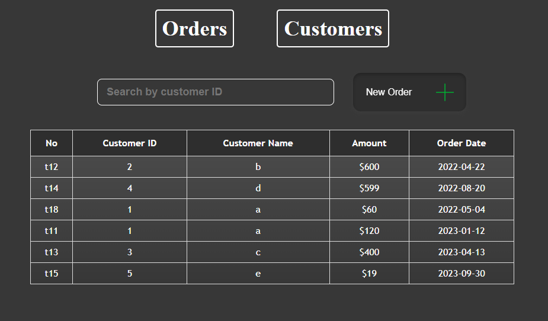
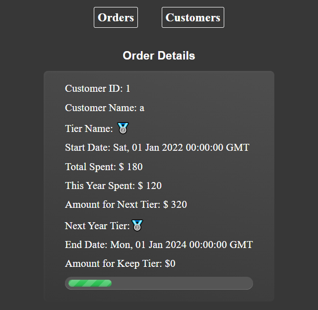

# Tier Client

## 利用可能なスクリプト

プロジェクト ディレクトリでは、次を実行できます。

### `yarn install`

### `yarn dev`

アプリを開発モードで実行します。\
[http://localhost:3000](http://localhost:3000) を開いてブラウザで表示します。

編集するとページが再読み込みされます。\
コンソールには lint エラーも表示されます。

### `yarn build`

実稼働用のアプリを「build」フォルダーにビルドします。\
React を実稼働モードに正しくバンドルし、最高のパフォーマンスが得られるようにビルドを最適化します。

ビルドは縮小され、ファイル名にはハッシュが含まれます。\
アプリをデプロイする準備ができました。

## ページ

###顧客
このページにはすべての顧客の情報が表示されます。

＃＃＃ 注文
注文履歴ページには、昨年のすべての注文が表示されます。

### 顧客の詳細

